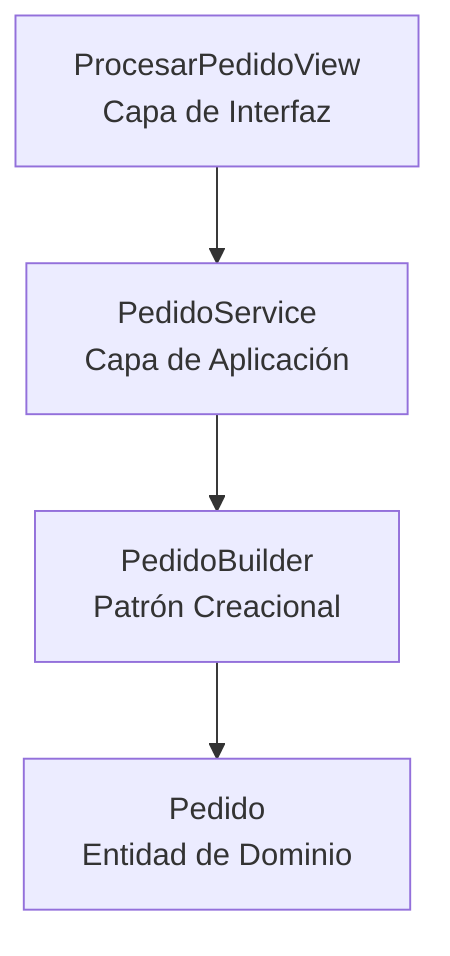

# Implementación del Patrón Creacional – SportCore

##  Contexto

En el sistema SportCore, el proceso de creación de un Pedido implica múltiples pasos:

- Asociar un cliente
- Agregar múltiples productos
- Crear detalles de pedido
- Validar que el pedido tenga al menos un producto
- Calcular el total
- Confirmar el pedido

Debido a esta complejidad, se decidió implementar el patrón creacional **Builder** para encapsular la construcción del objeto Pedido.

---

##  Objetivo del Patrón

Separar la lógica de construcción del objeto Pedido del flujo de la Vista y del Servicio, garantizando:

- Bajo acoplamiento
- Mayor mantenibilidad
- Construcción paso a paso
- Validación antes de persistencia

---

## Arquitectura Aplicada

El flujo de interacción entre componentes es el siguiente:

1. La Vista recibe la solicitud HTTP.
2. La Vista delega el procesamiento al PedidoService.
3. El Servicio utiliza el PedidoBuilder para construir el objeto Pedido.
4. El Builder crea el Pedido de manera controlada y lo persiste solo cuando es válido.

---

## Diagrama de Interacción

---

##  Flujo Detallado

###  Vista (ProcesarPedidoView)

Responsabilidad:
- Recibir datos del cliente.
- Instanciar el PedidoService.
- Retornar la respuesta HTTP.

No contiene lógica de negocio.

---

###  Service Layer (PedidoService)

Responsabilidad:
- Orquestar el caso de uso.
- Validar disponibilidad de inventario.
- Invocar el Builder.
- Calcular total.
- Procesar pago.
- Confirmar pedido.

Actúa como coordinador del proceso.

---

###  Builder (PedidoBuilder)

Responsabilidad:
- Construir el Pedido paso a paso.
- Agregar productos.
- Crear DetallePedido.
- Validar que el pedido tenga al menos un producto.
- Persistir el Pedido cuando es válido.

Implementa una construcción controlada del objeto complejo.

---

##  Justificación Técnica

El objeto Pedido es considerado complejo porque:

- Contiene múltiples DetallePedido.
- Requiere validaciones antes de guardarse.
- Involucra reglas de negocio.
- No puede existir vacío.

El uso del patrón Builder permite:

- Evitar constructores con múltiples parámetros.
- Encapsular la lógica de construcción.
- Cumplir el principio de Responsabilidad Única.
- Facilitar futuras extensiones del proceso de creación.

---

##  Beneficios Obtenidos

- Separación clara entre capas.
- Bajo acoplamiento.
- Código más limpio.
- Mejor mantenibilidad.
- Arquitectura preparada para evolución futura.
- Cumplimiento de principios SOLID.

---

##  Conclusión

La implementación del patrón creacional Builder en SportCore permite gestionar adecuadamente la construcción del Pedido, evitando que la Vista o el Servicio asuman responsabilidades que no les corresponden.

Esto mejora la calidad arquitectónica del sistema y facilita su evolución futura.

