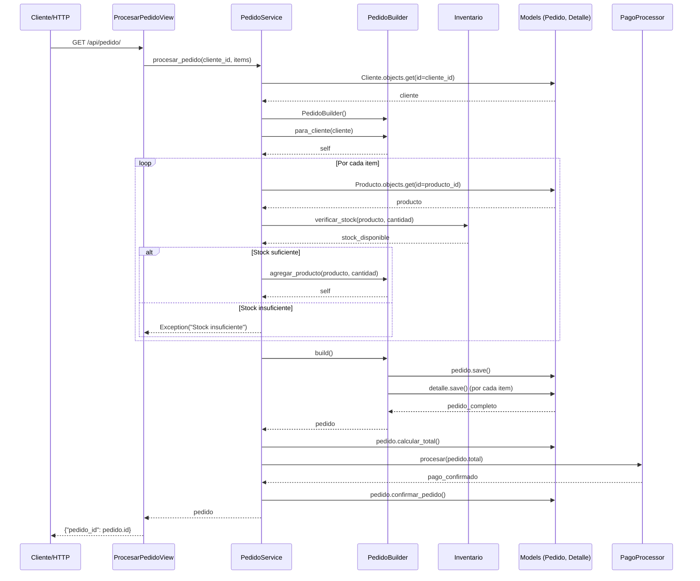

# SportCore - Sistema de Gestión de Pedidos Deportivos

Proyecto Django para la gestión de pedidos de productos deportivos con arquitectura limpia.

## 🚀 Características

- **Gestión de Categorías**: Organiza tus productos deportivos por categorías
- **Gestión de Clientes**: Registro y gestión de clientes
- **Gestión de Productos**: Catálogo de productos con precios y descripciones
- **Control de Inventario**: Seguimiento de stock en tiempo real
- **Sistema de Pedidos**: Creación y gestión de pedidos
- **API REST**: Endpoint para procesamiento de pedidos
- **Panel de Administración**: Interfaz Django Admin completa

## 📋 Modelos de Datos

- **Categorías**: Clasificación de productos
- **Clientes**: Información de clientes
- **Productos**: Catálogo de artículos deportivos
- **Inventarios**: Control de stock
- **Pedidos**: Gestión de órdenes
- **DetallePedidos**: Items de cada pedido

## 🛠️ Instalación

1. Clonar el repositorio
2. Crear entorno virtual: `python -m venv venv`
3. Activar entorno: `venv\Scripts\activate` (Windows)
4. Instalar dependencias: `pip install django==6.0.2`
5. Migrar la base de datos: `python manage.py migrate`
6. Crear superusuario: `python manage.py createsuperuser`
7. Iniciar servidor: `python manage.py runserver`

## 🔐 Acceso por Defecto

- **URL**: http://127.0.0.1:8000
- **Admin**: http://127.0.0.1:8000/admin
- **API**: http://127.0.0.1:8000/api/pedido/

## 📊 Arquitectura

```
sportcore/
├── config/          # Configuración Django
│   ├── settings.py  # Configuración principal
│   ├── urls.py      # URLs principales
│   └── wsgi.py      # WSGI configuration
├── sportcore_app/   # Aplicación principal
│   ├── application/ # Lógica de negocio (Service Layer)
│   │   └── services.py
│   ├── domain/      # Dominio y patrones
│   │   └── builders.py
│   ├── infra/       # Infraestructura
│   │   ├── factories.py
│   │   └── pagos.py
│   ├── models.py    # Modelos Django
│   ├── views.py     # Vistas y endpoints
│   ├── urls.py      # URLs de la app
│   └── admin.py     # Configuración admin
├── venv/           # Entorno virtual
└── db.sqlite3      # Base de datos
```

## 🏗️ Wiki Técnica

### 1. Justificación de la Estructura de Carpetas

La arquitectura sigue los principios de **Domain-Driven Design (DDD)** y **Clean Architecture**:

#### **config/**
- Contiene la configuración específica de Django
- Separación clara entre framework y lógica de negocio
- Facilita cambios de configuración sin afectar el dominio

#### **sportcore_app/application/**
- **Service Layer**: Contiene la lógica de negocio compleja
- `PedidoService`: Orquesta el flujo completo de procesamiento de pedidos
- Aplica **Single Responsibility Principle** y **Dependency Injection**

#### **sportcore_app/domain/**
- **Domain Layer**: Contiene patrones y lógica del dominio
- `builders.py`: Implementa **Builder Pattern** para construcción compleja
- Puro dominio sin dependencias de frameworks externos

#### **sportcore_app/infra/**
- **Infrastructure Layer**: Implementaciones concretas
- `factories.py`: **Factory Pattern** para creación de procesadores de pago
- `pagos.py`: Implementaciones de pasarelas de pago
- Permite fácil intercambio de implementaciones

#### **Ventajas de esta estructura:**
- **Testabilidad**: Cada capa puede ser probada independientemente
- **Mantenibilidad**: Cambios en una capa no afectan a otras
- **Escalabilidad**: Fácil adición de nuevos servicios y patrones
- **Desacoplamiento**: Framework separado de lógica de negocio

### 2. Diagrama de Secuencia - Procesamiento de Pedidos


```mermaid
sequenceDiagram
    participant Client as Cliente/HTTP
    participant View as ProcesarPedidoView
    participant Service as PedidoService
    participant Builder as PedidoBuilder
    participant Inventory as Inventario
    participant Models as Models (Pedido, Detalle)
    participant Payment as PagoProcessor

    Client->>View: GET /api/pedido/
    View->>Service: procesar_pedido(cliente_id, items)
    
    Service->>Models: Cliente.objects.get(id=cliente_id)
    Models-->>Service: cliente
    
    Service->>Builder: PedidoBuilder()
    Service->>Builder: para_cliente(cliente)
    Builder-->>Service: self
    
    loop Por cada item
        Service->>Models: Producto.objects.get(id=producto_id)
        Models-->>Service: producto
        
        Service->>Inventory: verificar_stock(producto, cantidad)
        Inventory-->>Service: stock_disponible
        
        alt Stock suficiente
            Service->>Builder: agregar_producto(producto, cantidad)
            Builder-->>Service: self
        else Stock insuficiente
            Service-->>View: Exception("Stock insuficiente")
        end
    end
    
    Service->>Builder: build()
    Builder->>Models: pedido.save()
    Builder->>Models: detalle.save() (por cada item)
    Models-->>Builder: pedido_completo
    Builder-->>Service: pedido
    
    Service->>Models: pedido.calcular_total()
    Service->>Payment: procesar(pedido.total)
    Payment-->>Service: pago_confirmado
    Service->>Models: pedido.confirmar_pedido()
    
    Service-->>View: pedido
    View-->>Client: {"pedido_id": pedido.id}
```

### 3. Preparación para API Gateway - Visión de Escalabilidad

#### **Arquitectura Preparada para Microservicios:**

**1. Service Layer Desacoplado:**
- `PedidoService` es agnóstico al framework web
- Puede ser expuesto como REST API, GraphQL, o gRPC
- Fácil migración a microservicios independientes

**2. Inyección de Dependencias:**
- `PagoProcessor` inyectado en `PedidoService`
- Permite diferentes implementaciones por entorno/canal
- Ideal para routing basado en servicios

**3. Separación de Responsabilidades:**
```
API Gateway → [Pedido Service] → [Pago Service]
              ↓
           [Inventario Service]
              ↓
           [Cliente Service]
```

**4. Estrategia de Escalabilidad:**

**Monolito Actual (Ready para Gateway):**
```
API Gateway
├── /api/pedidos → PedidoService
├── /api/inventario → InventarioService  
├── /api/clientes → ClienteService
└── /api/pagos → PagoFactory → PagoService
```

**Futura Arquitectura de Microservicios:**
```
API Gateway
├── /api/pedidos → Pedido Microservice
├── /api/inventario → Inventario Microservice
├── /api/clientes → Cliente Microservice
└── /api/pagos → Pago Microservice
```

**5. Beneficios para API Gateway:**
- **Rate Limiting**: Por servicio individual
- **Load Balancing**: Distribución entre instancias
- **Circuit Breaker**: Aislamiento de fallos
- **Authentication**: Centralizada en Gateway
- **Monitoring**: Métricas por servicio

**6. Implementación Recomendada:**
```python
# Ejemplo de preparación para Gateway
class PedidoController:
    def __init__(self, service: PedidoService):
        self.service = service
    
    def process_order(self, request):
        # Lógica de API Gateway
        # Validación, autenticación, rate limiting
        return self.service.procesar_pedido(
            cliente_id=request.cliente_id,
            items=request.items
        )
```

## 🏃‍♂️ Uso

1. Accede al panel de admin para gestionar datos
2. Crea categorías, productos y clientes
3. Gestiona el inventario
4. Procesa pedidos vía API
5. Monitorea el estado de los pedidos

## 📝 Ejemplos

### API de Pedidos
```bash
GET http://127.0.0.1:8000/api/pedido/
# Respuesta: {"pedido_id": 1}
```

## 🤝 Contribución

1. Fork del proyecto
2. Crear feature branch
3. Commit changes
4. Push to branch
5. Pull Request

## 📄 Licencia

MIT License
